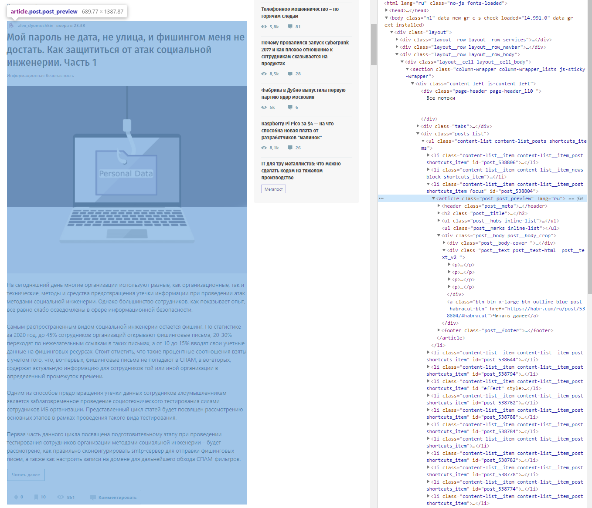

# Домашнее задание к лекции 6.«Web-scrapping»

Попробуем получать интересующие нас статьи на [хабре](https://habr.com) самыми первыми :)

Необходимо парсить страницу со свежими статьями ([вот эту](https://habr.com/ru/all/)) и выбирать те статьи, в которых встречается хотя бы одно из ключевых слов (эти слова определяем в начале скрипта). Поиск вести по всей доступной preview-информации (это информация, доступная непосредственно с текущей страницы).
Вывести в консоль список подходящих статей в формате: <дата> - <заголовок> - <ссылка>.

Пример preview:



Шаблон кода:

```python
# определяем список ключевых слов
KEYWORDS = ['дизайн', 'фото', 'web', 'python']

# Ваш код
```

---

## Дополнительное (необязательное) задание

Улучшить скрипт так, чтобы он анализировал не только preview-информацию статьи, но и весь текст статьи целиком.

Для этого потребуется получать страницы статей и искать по тексту внутри этой страницы.

---

Домашнее задание сдается ссылкой на репозиторий [BitBucket](https://bitbucket.org/) или [GitHub](https://github.com/)

Не сможем проверить или помочь, если вы пришлете:

- архивы;
- скриншоты кода;
- теоретический рассказ о возникших проблемах.
